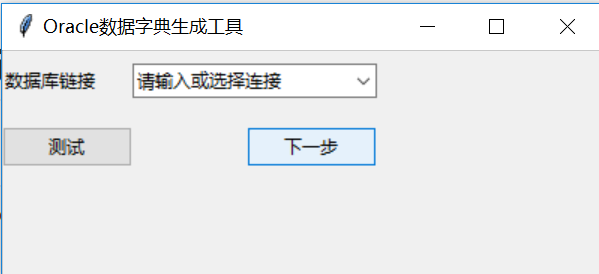

# pyddt

数据库表结构说明文档生成器。
根据登录用户权限, 查询表清单，用户按需批量导出数据库表结构说明。

## 注意 Attention
UI 比较简陋

自带目录

保存格式为xls/docx

目前仅支持Oracle


## 前提条件 Prerequisite

* Oracle Instant Client or Oracle client 安装并配置

* Python 3.x 

  ```bash
  pip install cx_Oracle
  pip install pandas
  pip install tkinter
  pip install xlrd
  pip install xlutils
  pip install logging
  pip install python-docx
  ```


## 使用方法 Usage

* 程序入口 app.py

  ```bash
  python app.py # src/app/app.py
  
  ```


## 操作指引

### 主界面

[代码位置](src/app/app.py)




#### 布局


1.`数据库链接`下拉框支持输入或者选择已有的数据库链接。

2.`数据库链接`字符串的格式为“user/pass@db”.

   - db 是配置在tnsnames.ora 文件中。
   - tnsname文件的典型配置如下：

    ```
    db = (DESCRIPTION =
    (ADDRESS = (PROTOCOL = TCP)(HOST = 127.0.0.1)(PORT = 1521))
    (CONNECT_DATA =
      (SERVER = DEDICATED)
      (SERVICE_NAME = orcl)))
    ```

3. `测试` 按钮就是测试数据库是否可以成功连接。
4. `下一步`按钮，点击后转入[工作台](#user-content-工作台)
5. 输入的数据库链接在成功连接到数据库之后，会自动保存在[配置文件](src/gui/options.ini)中，下次打开`主窗口`时，会被自动加载到下拉框列表中以供选择。如果不想保留，请使用后删除`options.ini`文件

### 工作台

[代码位置](src/gui/work_panel.py)


#### 窗体布局

从左上角到右下角，依次是：

1.数据库对象浏览树 （分割符（可拖动））

2.按钮操作区：

* `->` 将`数据库对象浏览树`中选中的表添加至`待导出列表`
* `<-`清除`待导出列表`中选中的
* `->>`将`数据库对象浏览树`中所有表添加到`待导出列表`
* `<<-`清空`待导出列表`

3.待导出列表

4.生成文档按钮

文档默认保存在`exports`路径下.

### 配置文件

参考[《options-sample.ini》](src/gui/options-sample.ini)

其实根本不需要配置！配置文件会自动创建并保存成功连接的数据库信息。如果不想保存此信息，请用完后删除options.ini

### 数据库文档保存位置

默认保存在`src/app/exports/`下面，如果路径不存在，会自动创建

## Bug report & feature request

Receiver: itbuddy@163.com
Subject: pyddt bug | pyddt feature request.

